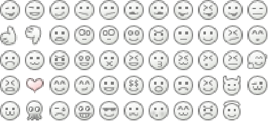

# [][project]

[][project] [][issues] [](LICENSE "License") <span style="float:right;">[][flattr] [][paypal]</span>

> Simple Smileys is a cohesive collection of smileys and emoticons designed to work well alongside text on websites or in applications.

## About

`Simple Smileys` is a collection of simple and still expressive smileys for the [Grav Smileys Plugin](https://github.com/sommerregen/grav-plugin-smileys) in a [GetGrav.org](http://getgrav.org) installation. It includes more than 50 smileys, each one having its own textual representation as can been seen [below](#contents) .



## Installation

To install this data pack, just download the zip version of this repository and unzip it under `user/data/smileys`. Then, rename the folder to `simple_smileys`.

You should now have all the data pack files under

	user/data/smileys/simple_smileys

>> NOTE: This data pack is a modular component for Grav Smileys Plugin which requires [Grav](http://github.com/getgrav/grav), [Grav Smileys Plugin](https://github.com/sommerregen/grav-plugin-smileys) and a theme to be installed in order to operate.

## Usage

To activate and use `Simple Smileys` the best process is to copy the [smileys.yaml](https://github.com/sommerregen/grav-plugin-smileys/smileys.yaml) file from the [Grav Smileys Plugin](https://github.com/sommerregen/grav-plugin-smileys) into your `users/config/plugins/` folder (create it if it doesn't exist), and  set the smileys package option to

```yaml
pack: simple_smileys
```

You can then use any of the below smiley acronyms in your pages and `Grav Smileys Plugin` will automatically convert them to their icon graphic file equivalent. As an example

```
I love you <3
```

will then transform to

<code>I love you </code>

### Contents

`Simple Smileys` comes [pre-configured](simple_smileys.yaml) with each smiley entry having the format

```yaml
<your-smiley-file-without-extension>:
	enabled: true | false
	acronyms: "<your space separated acronyms e.g. :-) :)>"
	description: "<your description>"
```

In other words, smilies can be disabled separately by setting `enabled: false` or modified by setting your own description and/or smiley acronyms.

By default many smiley acronyms are supported. For a detailed list, please open the configuration file [simple_smileys.yaml](simple_smileys.yaml).

## Contributing

You can contribute at any time! Before opening any issue, please search for existing issues and review the [guidelines for contributing](CONTRIBUTING.md).

After that please note:

* If you find a bug, would like to make a feature request or suggest an improvement, [please open a new issue][issues]. If you have any interesting ideas for additions to the syntax please do suggest them as well!
* Feature requests are more likely to get attention if you include a clearly described use case.
* If you wish to submit a pull request, please make again sure that your request match the [guidelines for contributing](CONTRIBUTING.md) and that you keep track of adding unit tests for any new or changed functionality.

> If you directly want to contribute an addition to Simple Smileys, be it a new smiley/emoticon or a package for an IM client, please send it to contribute@simplesmileys.org.

### Support and donations

If you like my project, feel free to support me via [][flattr] or by sending me some bitcoins to [**1HQdy5aBzNKNvqspiLvcmzigCq7doGfLM4**][bitcoin].

Thanks!

## License

Copyright (c) 2015 [Benjamin Regler][github]. See also the list of [contributors] who participated in this project.

1. **Grav Smileys Data Pack - Simple Smileys** is [dual-licensed](LICENSE) for use under the terms of the [MIT][mit-license] or [GPLv3][gpl-license] licenses.

    ![GNU license - Some rights reserved][gnu]

2. **Simple Smileys** is released into the [public domain][public-domain], meaning it is free (as in _freedom_) for **any** purpose. 

    Created by [Leo Bolin](http://leobolin.com/).

    

[github]: https://github.com/sommerregen/ "GitHub account from Benjamin Regler"
[gpl-license]: http://opensource.org/licenses/GPL-3.0 "GPLv3 license"
[mit-license]: http://www.opensource.org/licenses/mit-license.php "MIT license"

[flattr]: https://flattr.com/submit/auto?user_id=Sommerregen&url=https://github.com/sommerregen/grav-data-smileys-simple-smileys "Flatter my GitHub project"
[paypal]: https://www.paypal.com/cgi-bin/webscr?cmd=_s-xclick&hosted_button_id=SYFNP82USG3RN "Donate for my GitHub project using PayPal"
[bitcoin]: bitcoin:1HQdy5aBzNKNvqspiLvcmzigCq7doGfLM4?label=GitHub%20project "Donate for my GitHub project using BitCoin"
[gnu]: https://upload.wikimedia.org/wikipedia/commons/thumb/3/33/License_icon-gpl-88x31.svg/88px-License_icon-gpl-88x31.svg.png "GNU license - Some rights reserved"

[project]: https://github.com/sommerregen/grav-data-smileys-simple-smileys
[issues]: https://github.com/sommerregen/grav-data-smileys-simple-smileys/issues "GitHub Issues for Grav Smileys Data Pack"
[contributors]: https://github.com/sommerregen/grav-data-smileys-simple-smileys/graphs/contributors "List of contributors of the project"

[simple-smileys]: http://leobolin.com/
[public-domain]: http://creativecommons.org/publicdomain/mark/1.0/
