

<h2 id="heading">Software Freedom Day</h2>

Software Freedom Day (SFD) is an annual worldwide celebration of Free Software. SFD is a public education effort with the aim of increasing awareness of Free Software and its virtues, and encouraging its use.  
  
Software Freedom Day was established in 2004 and was first observed on 28 August of that year. About 12 teams participated in the first Software Freedom Day. Since that time it has grown in popularity and every year we have more than 300 events organized by over 100 cities from the world.

SFD will be celebrated at National Institute of Technology, Hamirpur on 17th September, 2016.
GLUG-NITH will be organising various events(including fun events) and workshops to unravel the power of FOSS and Open Source. We also aim to promote the use of Linux.

You might now be wondering what FOSS (Free and Open-Source Software) is and what all this hype is about.  
**Free Software** is:
> Free to use   
> Free to study   
> Free to distribute   
> Free to modify   
> Free to access   
> Free to share   
  
<h4 id="heading">Events</h4>  

<h5 id="b1">Distro Dexter</h5>
<ul>
<li>A WhatsApp quiz on open-source (mainly on different Linux distros), exclusively for freshers.  
<li>Duration of the event: 7 days</li>  
<li>Timing: 5:30 pm to 9:00 pm</li>   
<li>You will be asked 2 questions per day</li>
<li>Individual participation (no teams allowed)</li>  
<li>Cool prizes to be won</li>  
</ul>
Contact: 

<h5>Speed Typing</h5>
<ul>
<li>An online typing competition... lets see who 'types' the fastest</li>  
<li>Hosted on <a href="http://play.typeracer.com">play.typeracer.com</a></li>  
<li>Winners will get cool prizes</li>   
<li>GLUG-NITH membership</li>   
</ul>
Contact: 

<h5>Code Fights</h5>
<ul>
<li>Look for the bug</li>  
<li>Debug</li>  
<li>whatever</li>  
</ul>
Contact: 

<h5>Linux Installation Fest</h5>
<ul>
<li>Introduction to varios Linux distros
<li>Installation various Linux distros on students' PCs.  
<li>Students will learn about different distros and how to install them in multi-boot mode.   
<li>Included distros : Ubuntu, Fedora, Mint, Arch Linux, Elementary OS, Zorin, Kali Linux, Kubuntu  
</ul>
Contact:  

<h4 id="heading">Workshops</h4>  

<h5>Introduction to Open-source</h5>
<ul>
<li>abcdef   
<li>fvygbk  
<li>vvui  
</ul>
Contact:  

<h5>Introduction to Linux</h5>
<ul>
<li>abcdef   
<li>fvygbk  
<li>vvui
</ul>
Contact:

<h5>Introduction to Linux command line</h5>
<ul>
<li>Learn about how, why and when to use the command line  
<li>Learn various Linux commands  
<li>Time:    
<li>Venue:   
</ul>
Contact:  

<h5>FOSS alternatives to proprietary software</h5>
<ul>
<li>Discussion
<li>abcdef   
<li>vygbk  
<li>vvui  
</ul> 
Contact:  

<h4 id="heading">Gallery</h4>
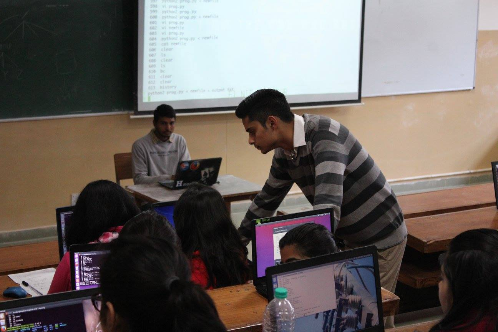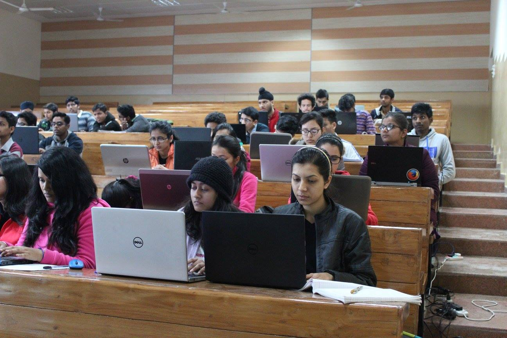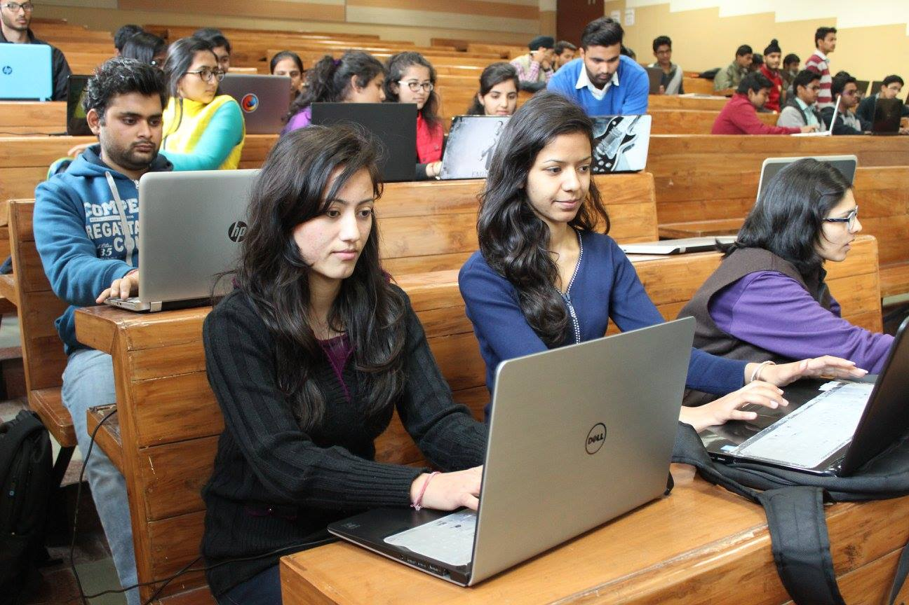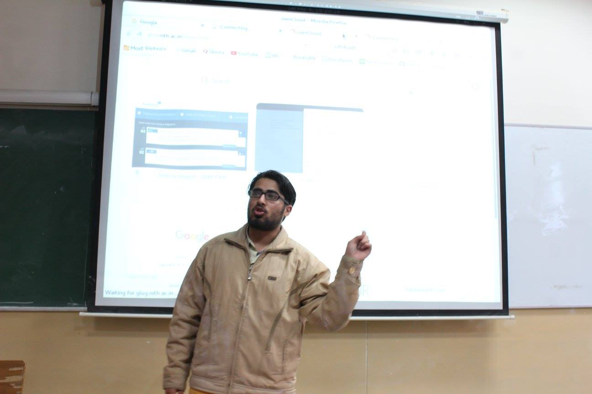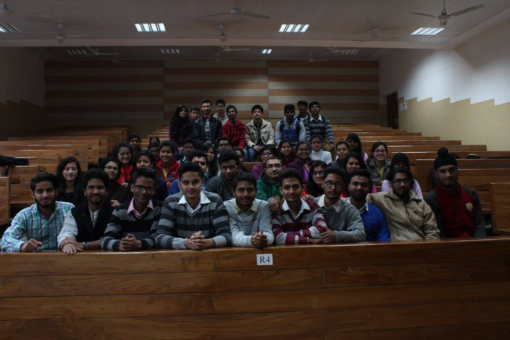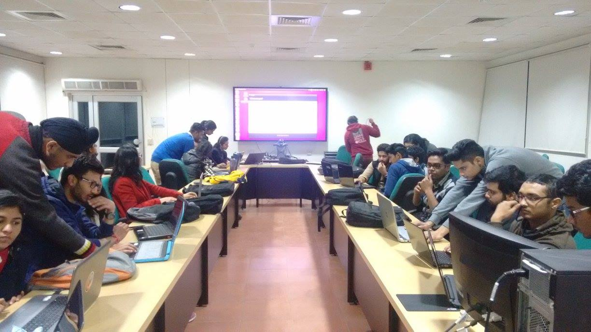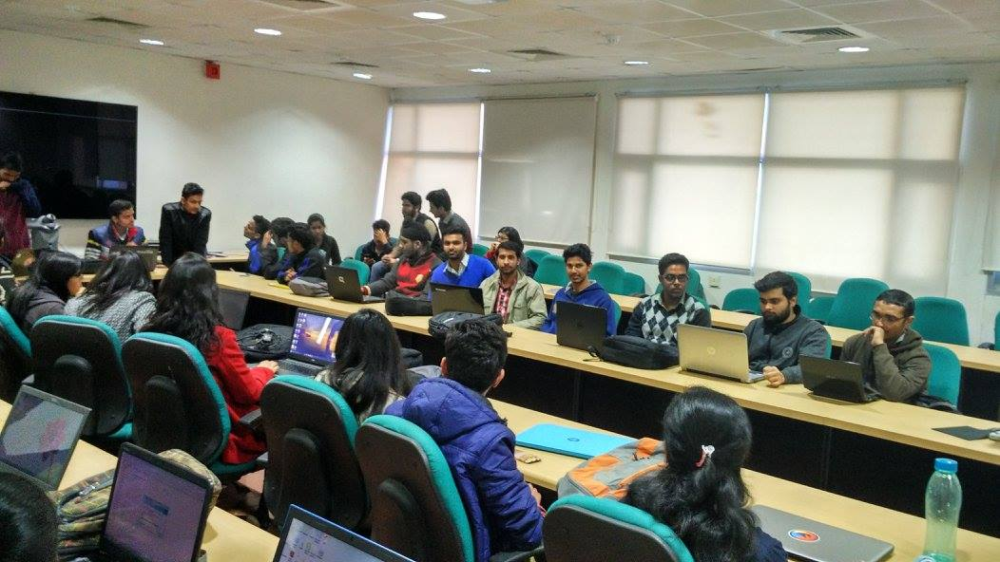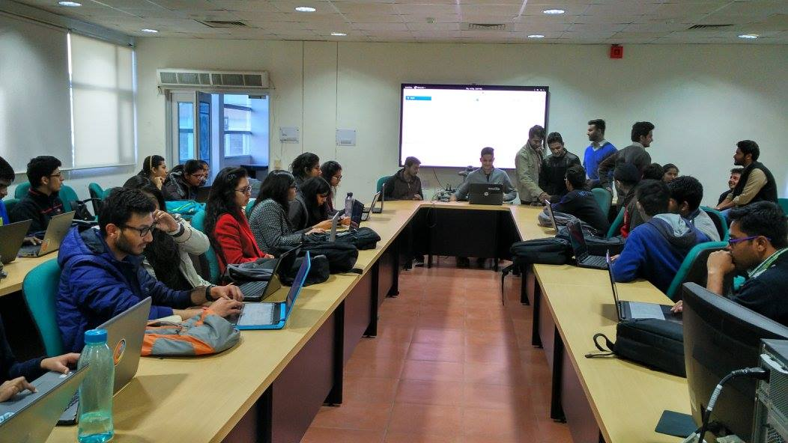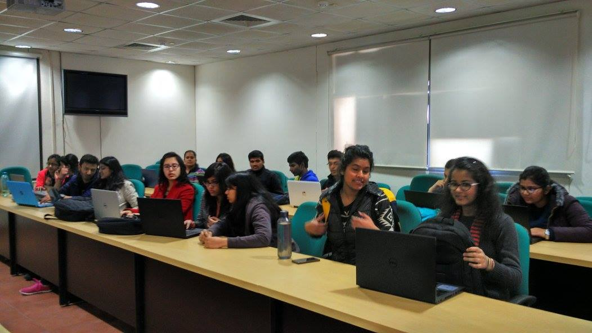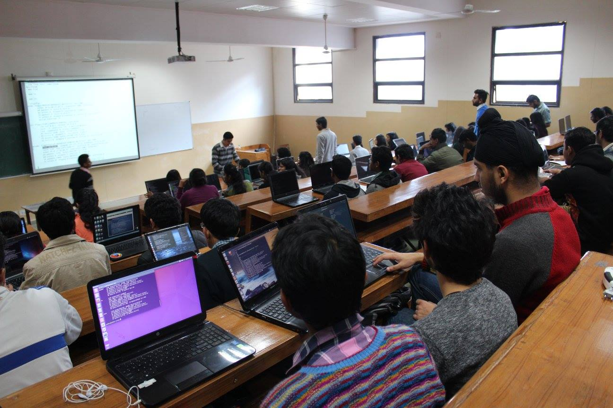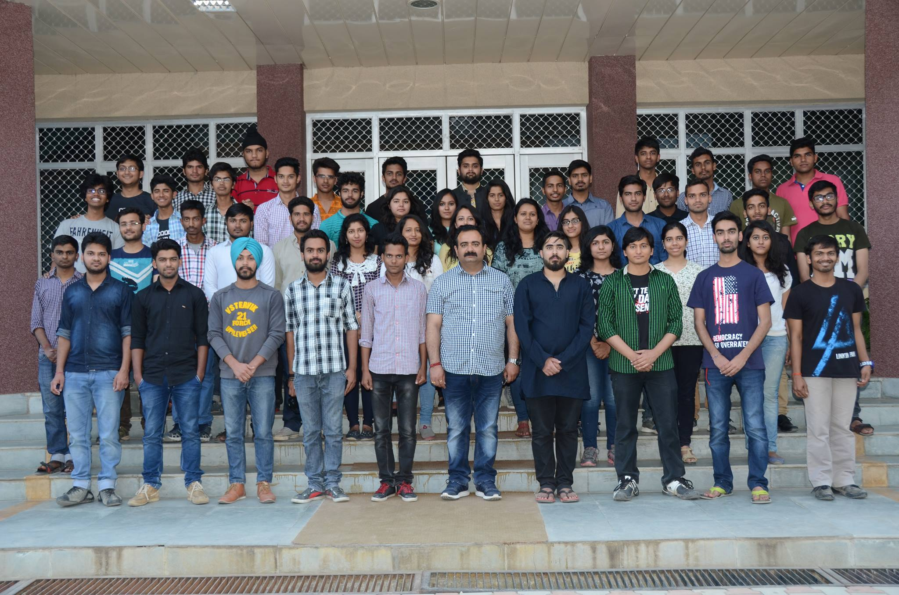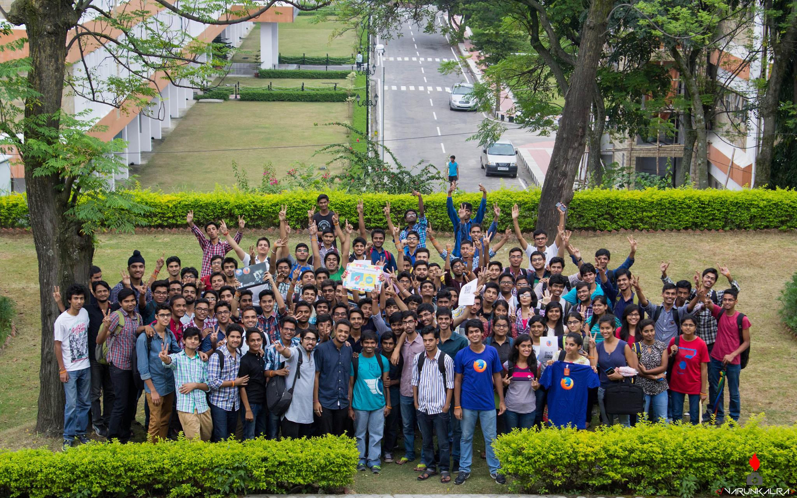

<h4 id="heading">Contact</h4>
* > abcdef: 1484956650  
* > vktnvrt: 385797554545  
* > ktvtrgv: 6596795668  

